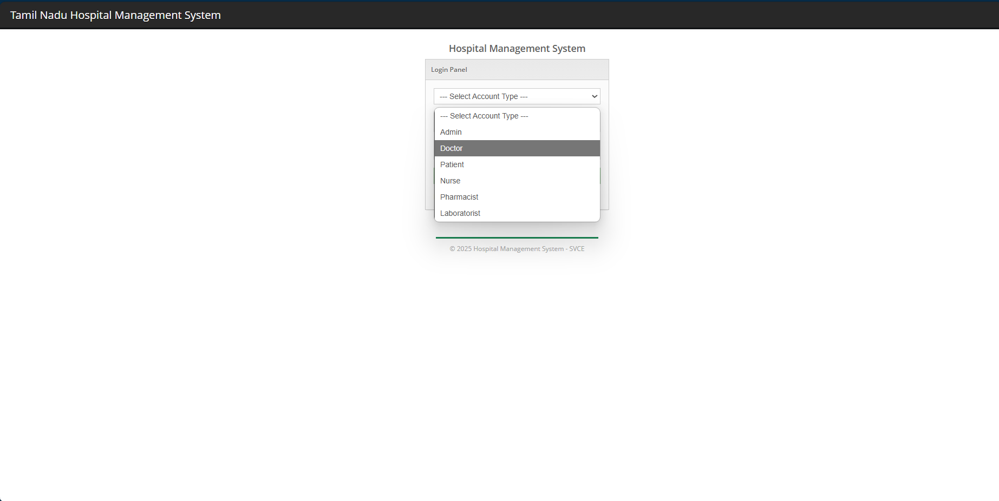
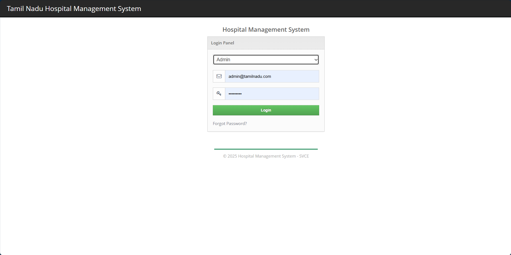
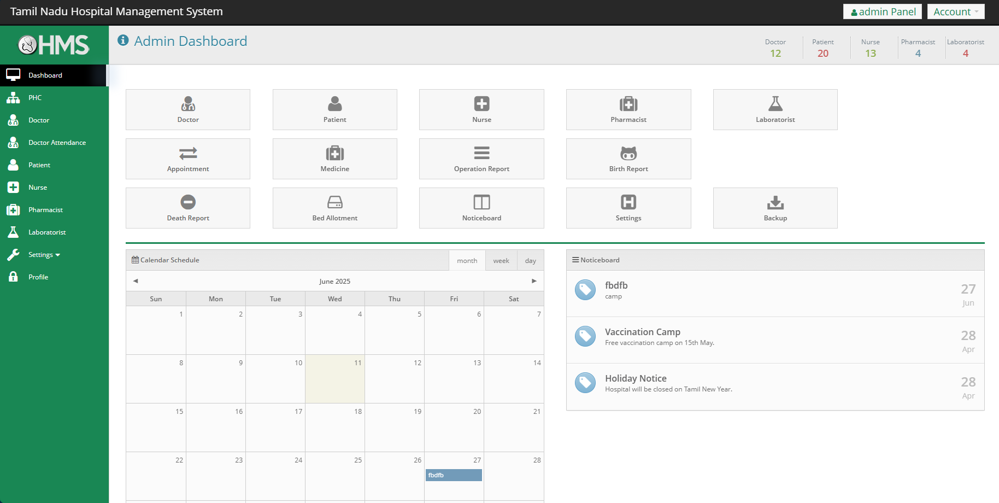
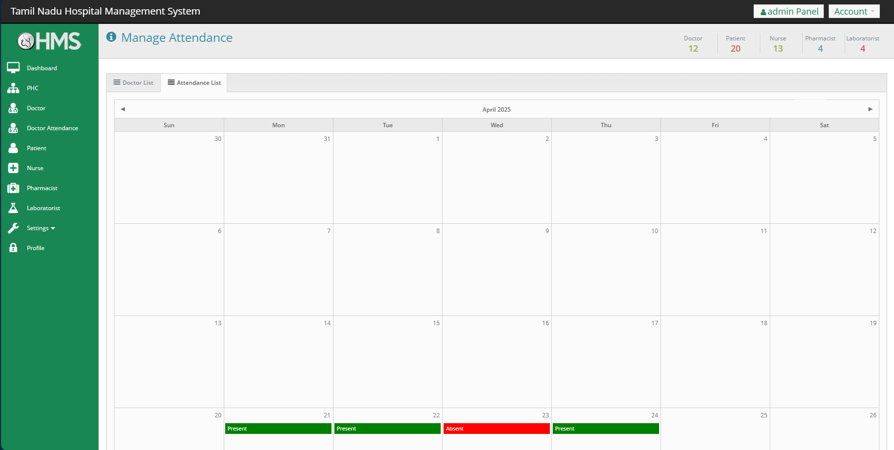
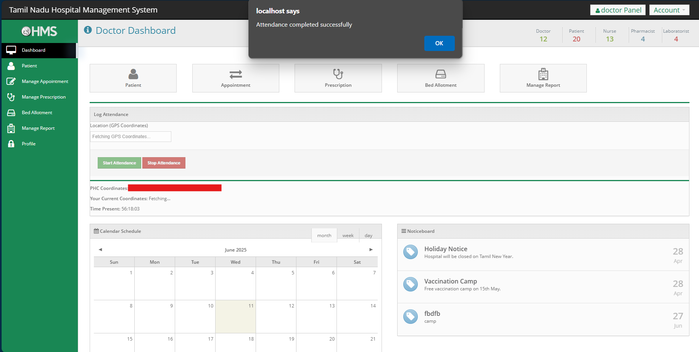
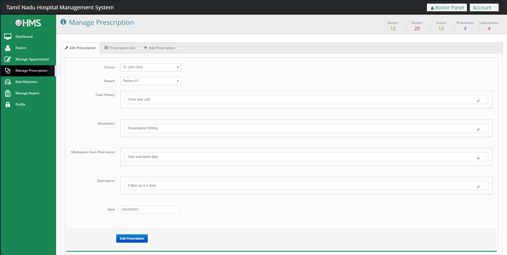

# Hospital Management System CI (HMSCI)

A web-based Hospital Management System built with CodeIgniter (PHP) for managing doctors, patients, nurses, pharmacists, laboratorists, appointments, reports, bed allotment, noticeboard, and more.

## Features
- Admin dashboard with quick access to all modules
- Manage doctors, patients, nurses, pharmacists, laboratorists
- Appointment scheduling and calendar view
- Medicine and report management (operation, birth, death)
- Bed allotment and status
- Noticeboard with latest updates
- System settings and backup/restore functionality

## Project Info
- **Project Name:** HMSCI (Hospital Management System CI)
- **Recommended PHP Version:** 5.6
- **Database Name:** `hmsci`
- **Framework:** CodeIgniter (PHP)

## Admin Login Details
- **Email:** admin@tamilnadu.com
- **Password:** Admin@123

## Installation
1. **Requirements:**
   - XAMPP/WAMP/LAMP with PHP 5.6
   - MySQL
2. **Setup:**
   - Place the project folder (`HMSCI`) in your web server's root directory (e.g., `htdocs` for XAMPP).
   - Import the database from `database/DATABASE FILE/hmsci.sql` into your MySQL server.
   - Update database credentials in `application/config/database.php` if needed.
3. **Run:**
   - Start Apache and MySQL from XAMPP/WAMP.
   - Open your browser and go to `http://localhost/HMSCI`.
   - Login using the admin credentials above.

## Usage
- Use the dashboard to navigate between modules.
- Manage hospital staff, patients, appointments, and reports.
- View and post notices on the noticeboard.
- Backup and restore the database from the admin panel.

## Notes
- For more projects, visit [codeastro.com](https://codeastro.com)
- For any issues, ensure your PHP version is compatible and all required extensions are enabled.

## Problem Statement
This project was developed for the following problem statement:

> "How might we develop a centralized digital platform to connect all PHCs, Upgraded PHCs, and Sub-Centers with the Deputy Director of Health Services (DDHS), enabling real-time monitoring of doctor attendance, healthcare services, and automated absenteeism alerts to improve healthcare delivery across divisions?"

## Screenshots
Below are screenshots of some of the basic and important components of the Hospital Management System CI (HMSCI). For more, explore the project in detail.

| Screenshot | Description |
|------------|-------------|
|  | Role-Based Access Control (RBAC) |
|  | Login Page |
|  | Admin Dashboard |
|  | Attendance Tracker |
|  | Doctor Attendance Log |
|  | Patient Prescription |

---
